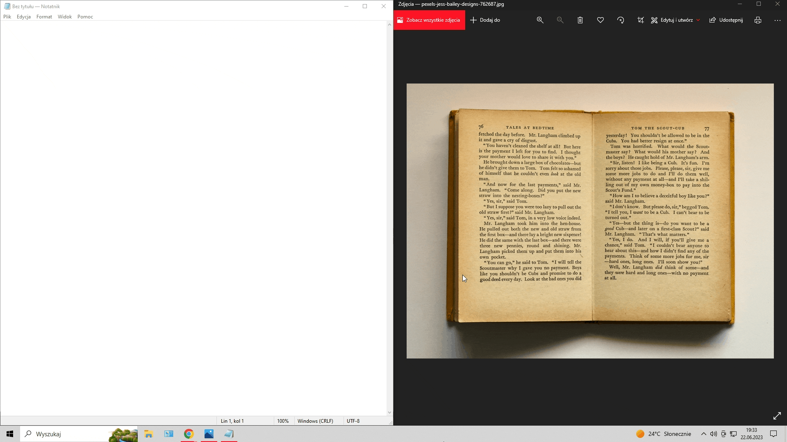

# QuickScan

The QuickScan app is a lightweight desktop application that allows you to capture a screenshot of any selected area on your screen and extract the text from the captured image using Tesseract OCR. The extracted text is then automatically copied to your clipboard for easy use.

## Features

- Capture a screenshot of a selected area on your screen.
- Utilize Tesseract OCR to extract text from the captured image.
- Automatically copy the extracted text to the clipboard.
- Works in the background, waiting for the user to press the hotkey combination (Alt + Shift + S) to trigger the screenshot and OCR process.

## Usage

1. Launch the Screenshot OCR App.
2. The application will run in the background and wait for the hotkey combination (Alt + Shift + S) to be pressed.
3. Select the area of the screen you want to capture by clicking and dragging the mouse cursor.
4. The captured image will be processed by OCR, and the extracted text will be automatically copied to your clipboard.
5. You can now paste the extracted text into any desired application or document.



## Installation

1. Go to the [Releases](https://github.com/your_username/your_application/releases) page.

2. Download the latest release package (`your_application-vX.X.X.zip` or `your_application-vX.X.X.tar.gz`) from the list of available releases.

3. Extract the downloaded package to a desired location on your computer.

4. Ensure that you have the necessary training files for Tesseract OCR. These training files are specific to different languages and are required for accurate text extraction. You can download the training files for your desired language from the [Tesseract GitHub repository](https://github.com/tesseract-ocr/tessdata) or other reliable sources.

5. Once you have the training files, create a folder in your application directory and name it `tessdata`. Place the downloaded training files (e.g., `eng.traineddata` for English language) into this `tessdata` folder.

6. Set up the TESSDATA_PREFIX environment variable to point to the `tessdata` folder. This variable tells Tesseract where to find the training files. The exact process for setting environment variables depends on your operating system.

   - For Linux/macOS:
     Open a terminal and run the following command:
     ```
     export TESSDATA_PREFIX=/path/to/your_application/tessdata
     ```
     
   - For Windows:
     Open the System Properties window, go to the "Advanced" tab, and click on the "Environment Variables" button. In the "System variables" section, click "New" to create a new variable with the name `TESSDATA_PREFIX` and the value set to the path of your `tessdata` folder.
     
7. Now your application is ready to use!


## Credits

The QuickScan app is developed by Paweł Wójcik.

## License

This project is licensed under the [Apache License 2.0](LICENSE).
